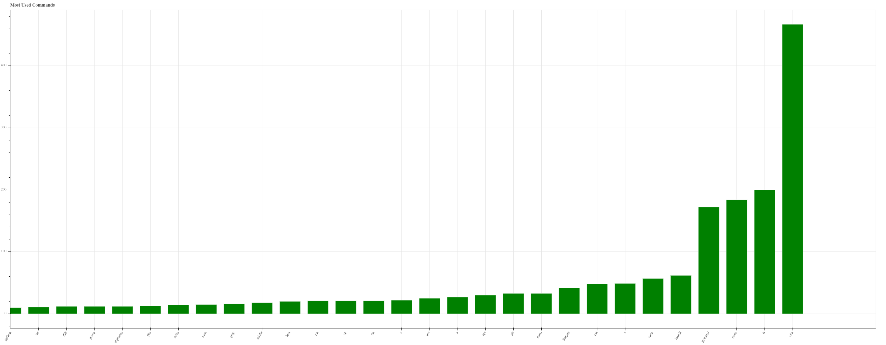
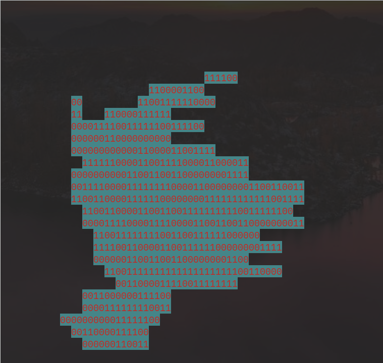

# My Old Projects, 2015-2019

These are all of my projects up to June 2019, dug from the depths of my code partition. All are `git`-less, some dysfunctional.

## C++ Time

When: unclear

Literally just a "hello" program which also declares a `double`, compiled. I guess I wanted to learn C++ from a book but it never really took off

## bash_history

When: June 2019

`.bash_history` stats: creates a [Bokeh](https://bokeh.org/) chart of most used commands (crude splitting but useful)

## mtt

When: June 2019

[Mind the Time](https://addons.mozilla.org/en-US/firefox/addon/mind-the-time/) stats: only prints total time in browser, and opens an empty [Bokeh](https://bokeh.org/) graph.

## jKeypad

When: 2018

My attempt at a calculator for how many keystrokes a string would need on my old phone (https://en.wikipedia.org/wiki/Samsung_E1200). I made some weird "state" thing for different typing modes (number mode, symbol mode), and nothing else really happened. I think I made a more complete JavaScript version - I'll have to look for it

## jobs

When: 2019

Me reviewing some programming languages (cos I was excited)

## sonnet_generator

When: 2019

I tried to make a node program to write sonnets from KJV Bible fragments - tried loads of bible `txt` files and libraries for splitting syllables, with no success. Would've been weird

## random_aw

When: 2019

A python script that grabs the [ArchWiki](https://wiki.archlinux.org/) table of contents, searches for links and opens a random one with the `webbrowser` module. You could just visit https://wiki.archlinux.org/index.php/Special:Random though!

## practical

When: 2017 and 2018

Contains some "practical" scripts of mine:

### cpu_load_blinkt.py

When: 2017

A [Blinkt!](https://shop.pimoroni.com/products/blinkt) CPU load indicator for the Raspberry Pi - more LEDs for more CPU load, also coloring:

| Load       | Color
|------------|--------|
| 0-37.5%    | Green  |
| 37.5-62.5% | Orange |
| 62.5-100%  | Red    |

### py-timer.py

When: 2018

A [pygame](https://www.pygame.org/) program that printed uptime in [3Dumb](https://www.fontsquirrel.com/fonts/3Dumb), a font I used for literally every pygame thing back then.

### PYGAME_TEMPLATE/main.py

A pygame template cloned from https://github.com/javiercantero/pygame-templates/blob/master/pygame-template.py

### words.txt

https://github.com/dwyl/english-words

## filez

When: June 2019

Me trying to show my friend how to read files in python

## lenny

When: Late 2019

Was supposed to grab and scrape https://www.lennyfaces.net/ and pipe it all into `dmenu`. Never really caught on cos _unicode issues_ - still has a "pseudo" file though...

## twitter_text

When: June 2019

Me and my friend wanted to print the twitter logo, colored, with binary stuff. We needed to scale for character height to get correct proportions, and it seemed rotated every time

## naxos_dict

When: Early 2019

In December 2018 I discovered [The Naxos Glossary of Musical Terms](https://www.naxos.com/education/glossary.asp). It's got great content but the website is ugly, unresponsive, and it opens popups for definitions which are often quite short. 

So I decided I needed to reformat the thing myself.

I built a program to download and scrape the site into a python `dict`. Then I needed a backend to read it and respond to HTTP requests, and a simple frontend with a nice AJAX interface. I planned on hosting it on my Raspberry Pi.

### Scraping

It downloaded and scraped the site into `glossary_dump.txt`
